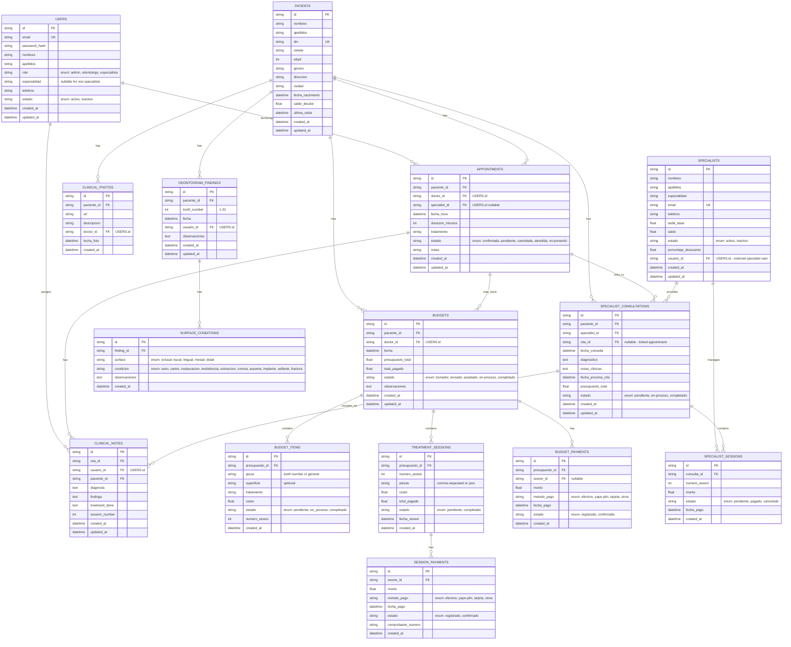

# Diagrama de Base de Datos - Sistema de Gestión Odontológica

## Descripción General

Sistema completo de gestión para clínica dental con:
- Gestión de pacientes
- Citas y calendario
- Odontogramas y hallazgos
- Presupuestos y pagos
- Historia clínica
- Gestión de especialistas externos
- Consultas de especialistas

## Diagrama ER (Mermaid)



## Descripción de Tablas Principales

### USERS
**Rol del usuario en el sistema:**
- `admin`: Administrador - acceso completo
- `odontologo`: Dentista - gestión completa de pacientes, presupuestos, odontogramas
- `especialista`: Especialista externo - solo acceso a sus citas asignadas, odontograma, historia clínica, y registrar consultas

**Campos importantes:**
- `role`: Define los permisos y módulos visibles
- `especialidad`: Llenar solo para especialistas (Ortodoncista, Periodoncista, etc.)

### PATIENTS
Datos demográficos y clínicos del paciente
- Información personal
- Saldo deudor
- Última visita

### APPOINTMENTS
Calendario de citas
- Vinculado a doctor (odontólogo) y opcionalmente a especialista
- Estados: confirmada, pendiente, cancelada, atendida, no-presentó
- Puede estar asociada a presupuesto o consulta de especialista

### ODONTOGRAM_FINDINGS
Hallazgos dentales por diente (FDI 1-32)
- Puede tener múltiples SURFACE_CONDITIONS (oclusal, bucal, lingual, mesial, distal)

### SURFACE_CONDITIONS
Condición de cada superficie dental
- Estados: sano, caries, restauración, endodoncia, extracción, corona, ausente, implante, sellante, fractura

### BUDGETS & BUDGET_ITEMS
Presupuestos de tratamiento
- BUDGET_ITEMS: Items individuales con pieza/superficie específica
- TREATMENT_SESSIONS: Agrupación por sesión
- SESSION_PAYMENTS: Pagos por sesión
- BUDGET_PAYMENTS: Pagos generales

### SPECIALIST_CONSULTATIONS
**Tabla especial para especialistas externos**
- Registran diagnóstico, notas clínicas, próxima cita
- Presupuesto total y desglose por sesión
- Cada sesión tiene su propio monto (costo por sesión)

### CLINICAL_NOTES
Notas clínicas de cada consulta/cita
- Diagnosis
- Findings (hallazgos)
- Treatment done (tratamiento realizado)
- Session number

### SPECIALIST_SESSIONS
Sesiones dentro de una consulta de especialista
- Número de sesión
- Monto por sesión
- Estado: pendiente, pagado, cancelado

## Relaciones Clave

1. **Usuario → Cita → Paciente**
   - Un doctor atiende múltiples citas
   - Un especialista externo puede tener citas asignadas
   - Una cita es para un paciente

2. **Paciente → Presupuesto → Items → Pagos**
   - Un paciente puede tener múltiples presupuestos
   - Cada presupuesto tiene items de tratamiento
   - Los pagos se rastrean por sesión

3. **Paciente → Especialista → Consulta Externa**
   - Un paciente puede tener múltiples consultas con diferentes especialistas
   - Cada consulta de especialista registra diagnóstico y próxima cita
   - Las sesiones del especialista tienen sus propios costos

4. **Odontograma → Superficie → Condición**
   - Un diente puede tener múltiples superficies
   - Cada superficie tiene una condición específica

## Acceso por Rol

### Odontólogo (doctor@clinicadental.com)
- ✅ Ver/editar todos los pacientes
- ✅ Crear/editar citas
- ✅ Crear odontogramas y registrar hallazgos
- ✅ Crear presupuestos
- ✅ Registrar pagos
- ✅ Ver historia clínica
- ✅ Asignar citas a especialistas externos
- ✅ Ver reportes y configuración

### Especialista Externo (especialista@clinicadental.com)
- ✅ Ver mis citas asignadas (calendario)
- ✅ Ver odontograma del paciente
- ✅ Ver historia clínica del paciente
- ✅ **Registrar consulta externa** (diagnóstico, notas, próxima cita, presupuesto total, costo por sesión)
- ❌ Crear presupuestos
- ❌ Registrar pagos
- ❌ Configuración
- ❌ Ver otros pacientes que no estén en sus citas

### Administrador
- ✅ Todo acceso
- ✅ Configuración del sistema
- ✅ Gestión de usuarios
- ✅ Reportes completos

## Campos para Consulta Externa (Especialista)

Cuando un especialista registra una consulta externa, debe capturar:

```
{
  diagnostico: string,           // Ej: "Mordida cruzada anterior, apiñamiento leve"
  notas_clinicas: text,          // Ej: "Requiere corrección de mordida"
  fecha_proxima_cita: datetime,  // Ej: "2026-07-29"
  presupuesto_total: float,      // Ej: 800.00
  sesiones: [
    {
      numero: 1,
      monto: 200.00,             // Costo de esta sesión
      estado: "pendiente"
    },
    {
      numero: 2,
      monto: 200.00,
      estado: "pendiente"
    }
  ]
}
```

## Índices Recomendados

```sql
CREATE INDEX idx_patients_dni ON patients(dni);
CREATE INDEX idx_appointments_paciente_fecha ON appointments(paciente_id, fecha_hora);
CREATE INDEX idx_appointments_doctor_fecha ON appointments(doctor_id, fecha_hora);
CREATE INDEX idx_appointments_specialist_fecha ON appointments(specialist_id, fecha_hora);
CREATE INDEX idx_budgets_paciente ON budgets(paciente_id);
CREATE INDEX idx_budgets_doctor ON budgets(doctor_id);
CREATE INDEX idx_clinical_notes_cita ON clinical_notes(cita_id);
CREATE INDEX idx_clinical_notes_paciente ON clinical_notes(paciente_id);
CREATE INDEX idx_odontogram_paciente ON odontogram_findings(paciente_id);
CREATE INDEX idx_specialist_consult_paciente ON specialist_consultations(paciente_id);
CREATE INDEX idx_specialist_consult_specialist ON specialist_consultations(specialist_id);
CREATE INDEX idx_clinical_photos_paciente ON clinical_photos(paciente_id);
```

## Notas de Implementación

1. **Sin Foreign Keys en MVP**: Para facilitar iteración, se recomienda no usar constraints FK en la primera versión, solo mantener la integridad a nivel de aplicación.

2. **Auditoría**: Todas las tablas incluyen `created_at` y `updated_at` para auditoría.

3. **Estados**: Usar enums para campos con valores finitos (estado, condición, método de pago).

4. **Soft Deletes**: Considerar agregar `deleted_at` para borrado lógico si es requerido.

5. **Seguridad**: En Neon + Drizzle, usar scoping por `userId` en cada query (no RLS).

